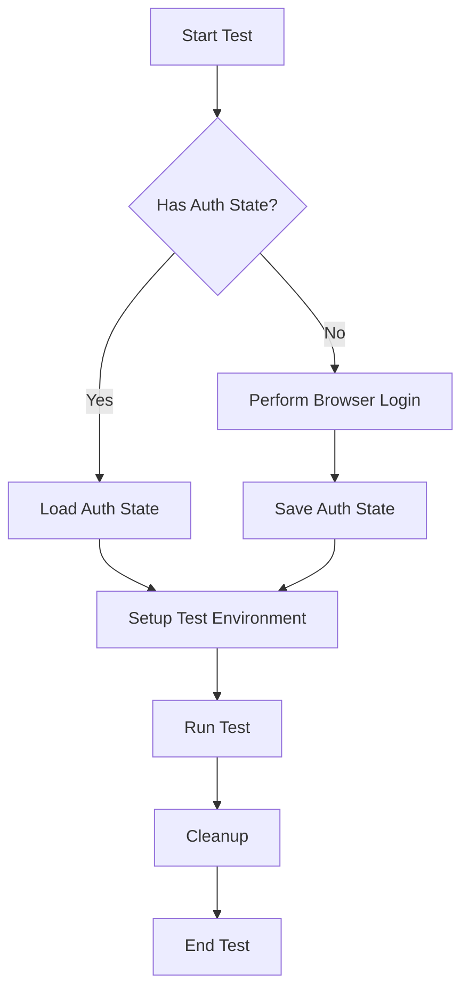
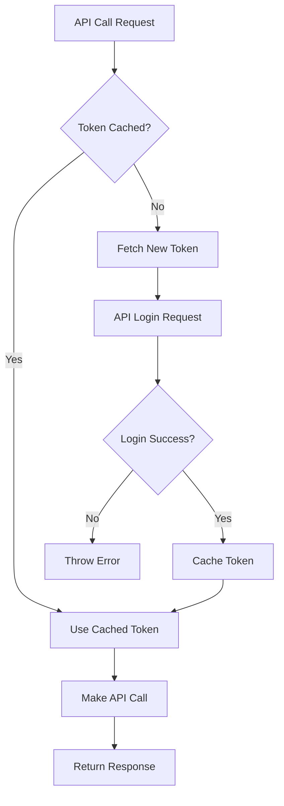
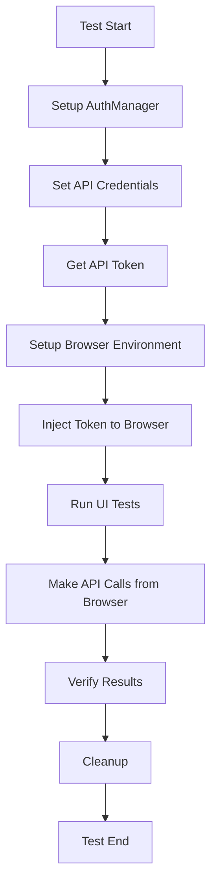

# 🚀 Playwright Unified Framework

A comprehensive, enterprise-grade test automation framework built with Playwright that combines **API testing**, **UI testing**, and **advanced authentication management** in a unified solution.

## 📋 Table of Contents

- [Overview](#overview)
- [Features](#features)
- [Architecture](#architecture)
- [Installation](#installation)
- [Configuration](#configuration)
- [Usage Examples](#usage-examples)
- [API Reference](#api-reference)
- [Flow Charts](#flow-charts)
- [Best Practices](#best-practices)
- [Troubleshooting](#troubleshooting)

## 🌟 Overview

The Playwright Unified Framework is designed to handle complex testing scenarios that require both **browser-based authentication** and **API token management**. It provides a clean, maintainable architecture that separates concerns while maintaining flexibility.

### 🎯 Key Benefits

- **🔄 Unified Authentication** - Same credentials for both API and UI testing
- **⚡ Token Caching** - Smart token management with automatic refresh
- **🌐 Multi-Browser Support** - Chromium, Firefox, and WebKit
- **📊 Professional Reporting** - Allure integration for detailed test reports
- **🔒 Secure Credentials** - Environment-based configuration
- **🧪 Test Isolation** - Fresh authentication state per test

## ✨ Features

### 🔐 Authentication Management
- **Browser Authentication** - State-based browser session management
- **API Token Management** - Automatic token fetching, caching, and injection
- **Token Injection** - Inject API tokens into browser contexts
- **Multi-Environment Support** - Different credentials for different environments

### 🌐 Browser Management
- **Multi-Browser Support** - Chromium, Firefox, WebKit
- **Headless/Headed Modes** - Configurable for different testing scenarios
- **State Persistence** - Save and reuse authentication states
- **Context Management** - Efficient browser context handling

### 📡 API Testing
- **HTTP Methods** - GET, POST, PUT, PATCH, DELETE
- **Token Integration** - Automatic authentication headers
- **Query Parameters** - Support for complex API calls
- **Response Handling** - Structured response management

### 📊 Reporting & Output
- **Allure Reports** - Professional test reporting
- **Screenshots** - Automatic failure screenshots
- **Video Recording** - Test execution recordings
- **Structured Output** - Organized test artifacts

## 🏗️ Architecture

```
┌─────────────────────────────────────────────────────────────────────────────────┐
│                        Playwright Unified Framework                            │
├─────────────────────────────────────────────────────────────────────────────────┤
│                                                                                 │
│  ┌─────────────────┐  ┌─────────────────┐  ┌─────────────────┐                  │
│  │      Tests      │  │      Utils      │  │      Config     │                  │
│  │                 │  │                 │  │                 │                  │
│  │   • API Flow    │  │   • AuthMgr     │  │   • Playwright  │                  │
│  │   • UI Flow     │  │   • apiUtils    │  │   • Allure      │                  │
│  │   • Examples    │  │   • BrowserMgr  │  │   • Browser     │                  │
│  └─────────────────┘  └─────────────────┘  └─────────────────┘                  │
│                                                                                 │
├─────────────────────────────────────────────────────────────────────────────────┤
│                                                                                 │
│  ┌─────────────────┐  ┌─────────────────┐  ┌─────────────────┐                  │
│  │    Test Data    │  │     Reports     │  │   Auth States   │                  │
│  │                 │  │                 │  │                 │                  │
│  │   • Credentials │  │     • Allure    │  │     • Browser   │                  │
│  │   • Payloads    │  │   • Screenshots │  │    • Sessions   │                  │
│  │   • Configs     │  │     • Videos    │  │     • States    │                  │
│  └─────────────────┘  └─────────────────┘  └─────────────────┘                  │
│                                                                                 │
└─────────────────────────────────────────────────────────────────────────────────┘
```

## 🚀 Installation

### Prerequisites
- Node.js (v16 or higher)
- npm or yarn
- Git

### Quick Start
```bash
# Clone the repository
git clone <your-repo-url>
cd playwright-unified-framework

# Install dependencies
npm install

# Install Playwright browsers
npx playwright install
```

### Environment Setup
```bash
# Create environment file
touch .env

# Edit .env with your credentials
API_USERNAME=your_username
API_PASSWORD=your_password
BASE_URL=https://yourapp.com
API_BASE_URL=https://api.yourapp.com
```

**Note:** The framework automatically loads environment variables from the `.env` file. Make sure to create this file in your project root directory.

## ⚙️ Configuration

### Playwright Configuration
```javascript
// playwright.config.js
module.exports = defineConfig({
  reporter: [
    ['line'],
    ['allure-playwright', {
      outputFolder: 'reports/allure-results',
      detail: true
    }]
  ],
  use: {
    screenshot: 'only-on-failure',
    video: 'retain-on-failure',
    trace: 'on-first-retry'
  },
  outputDir: 'reports/',
  projects: [
    { name: 'chromium', use: { ...devices['Desktop Chrome'] } },
    { name: 'firefox', use: { ...devices['Desktop Firefox'] } },
    { name: 'webkit', use: { ...devices['Desktop Safari'] } }
  ]
});
```

### Package Scripts
```json
{
  "scripts": {
    "test:chromium": "playwright test --project=chromium",
    "test:firefox": "playwright test --project=firefox",
    "test:webkit": "playwright test --project=webkit",
    "test:all": "playwright test --project=chromium && playwright test --project=firefox && playwright test --project=webkit",
    "show:allure": "npx allure serve reports/allure-results",
    "generate:allure": "npx allure generate reports/allure-results --clean",
    "open:allure": "npx allure open reports/allure-results"
  }
}
```

## 📖 Usage Examples

### 1. API Testing with Token Management

```javascript
const { test, expect } = require('@playwright/test');
const AuthManager = require('../utils/AuthManager');
const { apiUtils } = require('../utils/apiUtils');

test.describe('API Flow with Token Management', () => {
    let authManager;
    let apiUtilsInstance;

    test.beforeAll(async () => {
        // Initialize AuthManager
        authManager = new AuthManager();
        
        // Set API credentials
        authManager.setApiCredentials('https://api.yourapp.com', '/auth/login');
        
        // Initialize apiUtils with AuthManager integration
        const apiContext = {}; // Your API context here
        apiUtilsInstance = new apiUtils(apiContext, 'https://api.yourapp.com', authManager);
    });

    test.beforeEach(async () => {
        // Fresh token for each test (test isolation)
        await authManager.forceNewToken();
    });

    test('API calls with automatic token management', async () => {
        // All token-based methods now use AuthManager automatically
        const response = await apiUtilsInstance.getWithToken('/users/profile');
        expect(response.status()).toBe(200);
        
        // POST with token
        const userData = { name: 'Test User', email: 'test@example.com' };
        const postResponse = await apiUtilsInstance.postWithToken('/users', userData);
        expect(postResponse.status()).toBe(201);
    });
});
```

### 2. UI Testing with Browser Authentication

```javascript
const { test, expect } = require('@playwright/test');
const AuthManager = require('../utils/AuthManager');

test.describe('UI Flow with Browser Authentication', () => {
    let authManager;

    test.beforeAll(async () => {
        // Initialize AuthManager
        authManager = new AuthManager();
        
        // Perform browser authentication (saves state file)
        await authManager.authenticate({
            baseUrl: 'https://yourapp.com',
            userName: 'testuser',
            password: 'testpass'
        }, 'chromium');
    });

    test('Setup authenticated test environment', async () => {
        // Setup browser, context, and page with authentication
        const { browser, context, page } = await authManager.setupTestEnvironment('chromium');
        
        try {
            // Navigate to protected page
            await page.goto('https://yourapp.com/dashboard');
            
            // Should be authenticated (no login redirect)
            await expect(page).toHaveURL(/.*dashboard/);
            
            // Verify user is logged in
            await expect(page.locator('.user-profile')).toBeVisible();
            
        } finally {
            // Cleanup
            await authManager.cleanupTestEnvironment({ browser, context, page });
        }
    });
});
```

### 3. Combined API + UI Testing

```javascript
test('UI page with API token injection', async () => {
    // Setup browser environment
    const { browser, context, page } = await authManager.setupTestEnvironment('chromium');
    
    try {
        // Inject API token into browser context
        await authManager.injectTokenToBrowserContext(context);
        
        // Navigate to page
        await page.goto('https://yourapp.com/dashboard');
        
        // Token is now available in browser context
        const token = await page.evaluate(() => window.apiToken);
        expect(token).toBeTruthy();
        
        // Can make authenticated API calls from browser
        const apiResponse = await page.evaluate(async () => {
            const headers = window.getAuthHeaders();
            return await fetch('/api/users/profile', { headers });
        });
        
        // Verify API call was made with token
        expect(apiResponse).toBeTruthy();
        
    } finally {
        await authManager.cleanupTestEnvironment({ browser, context, page });
    }
});
```

## 🔧 API Reference

### AuthManager Class

#### Constructor
```javascript
const authManager = new AuthManager();
```

#### Browser Authentication Methods

| Method | Description | Parameters |
|--------|-------------|------------|
| `authenticate(credentials, browserName)` | Perform login and save auth state | `credentials: {baseUrl, userName, password}`, `browserName?: string` |
| `setupTestEnvironment(browserName)` | Setup authenticated test environment | `browserName?: string` |
| `cleanupTestEnvironment(env)` | Cleanup test environment | `env: {browser, context, page}` |
| `hasStateFile(browserName)` | Check if auth state exists | `browserName?: string` |
| `getStateFilePath(browserName)` | Get auth state file path | `browserName?: string` |

#### API Token Management Methods

| Method | Description | Parameters |
|--------|-------------|------------|
| `setApiCredentials(baseUrl, loginEndpoint)` | Set API credentials | `baseUrl: string`, `loginEndpoint?: string` |
| `getApiToken()` | Get API token (cached if available) | None |
| `getApiAuthHeaders()` | Get auth headers for API requests | None |
| `injectTokenToBrowserContext(context)` | Inject token into browser context | `context: BrowserContext` |
| `clearApiToken()` | Clear token cache | None |
| `forceNewToken()` | Force fetch new token | None |

### apiUtils Class

#### Constructor
```javascript
const api = new apiUtils(apiContext, apiURL, authManager);
```

#### HTTP Methods

| Method | Description | Parameters |
|--------|-------------|------------|
| `get(endpoint, headers)` | GET request | `endpoint: string`, `headers?: object` |
| `getWithToken(endpoint, headers)` | GET with auth token | `endpoint: string`, `headers?: object` |
| `post(endpoint, body, headers)` | POST request | `endpoint: string`, `body: any`, `headers?: object` |
| `postWithToken(endpoint, body, headers)` | POST with auth token | `endpoint: string`, `body: any`, `headers?: object` |
| `put(endpoint, body, headers)` | PUT request | `endpoint: string`, `body: any`, `headers?: object` |
| `patch(endpoint, body, headers)` | PATCH request | `endpoint: string`, `body: any`, `headers?: object` |
| `delete(endpoint, headers)` | DELETE request | `endpoint: string`, `headers?: object` |

## 🔄 Flow Charts

### Authentication Flow

**ASCII Version (Bitbucket Compatible):**
```
┌─────────────────────────────────────────────────────────────────────────────────┐
│                           Authentication Flow                                  │
├─────────────────────────────────────────────────────────────────────────────────┤
│                                                                                 │
│  Start Test → Has Auth State? → Load Auth State                               │
│                    ↓                                                           │
│              Perform Login → Save Auth State                                   │
│                    ↓                                                           │
│              Setup Test Environment → Run Test                                 │
│                    ↓                                                           │
│              Cleanup → End Test                                                │
│                                                                                 │
└─────────────────────────────────────────────────────────────────────────────────┘
```

**Mermaid Version (GitHub Compatible):**


### API Token Flow

**ASCII Version (Bitbucket Compatible):**
```
┌─────────────────────────────────────────────────────────────────────────────────┐
│                           API Token Flow                                       │
├─────────────────────────────────────────────────────────────────────────────────┤
│                                                                                 │
│  API Call Request → Token Cached? → Use Cached Token                           │
│                    ↓                                                           │
│              Fetch New Token → API Login Request                               │
│                    ↓                                                           │
│              Login Success? → Cache Token                                      │
│                    ↓                                                           │
│              Make API Call → Return Response                                   │
│                                                                                 │
└─────────────────────────────────────────────────────────────────────────────────┘
```

**Mermaid Version (GitHub Compatible):**


### Combined Testing Flow

**ASCII Version (Bitbucket Compatible):**
```
┌─────────────────────────────────────────────────────────────────────────────────┐
│                         Combined Testing Flow                                   │
├─────────────────────────────────────────────────────────────────────────────────┤
│                                                                                 │
│  Test Start → Setup AuthManager → Set API Credentials                           │
│                    ↓                                                           │
│              Get API Token → Setup Browser Environment                          │
│                    ↓                                                           │
│              Inject Token to Browser → Run UI Tests                             │
│                    ↓                                                           │
│              Make API Calls from Browser → Verify Results                       │
│                    ↓                                                           │
│              Cleanup → Test End                                                 │
│                                                                                 │
└─────────────────────────────────────────────────────────────────────────────────┘
```

**Mermaid Version (GitHub Compatible):**


## 🎯 Best Practices

### 1. Test Organization
- **Group related tests** using `test.describe()`
- **Use descriptive test names** that explain the scenario
- **Implement proper setup/teardown** with `beforeAll`, `beforeEach`, `afterEach`, `afterAll`

### 2. Authentication Management
- **Set API credentials early** in `beforeAll`
- **Use fresh tokens per test** for isolation
- **Clear tokens after tests** to prevent interference
- **Handle authentication errors** gracefully

### 3. Browser Management
- **Always cleanup** browser resources in `finally` blocks
- **Use appropriate browser modes** (headless for CI, headed for debugging)
- **Leverage state files** for faster test execution

### 4. API Testing
- **Use token-based methods** when authentication is required
- **Handle different response formats** gracefully
- **Implement proper error handling** for API failures

### 5. Environment Management
- **Use environment variables** for sensitive data
- **Separate test data** from test logic
- **Support multiple environments** (dev, staging, prod)

## 🚨 Troubleshooting

### Common Issues

#### 1. Authentication Failures
```bash
# Error: Authentication failed
# Solution: Check credentials and network connectivity
```

#### 2. Token Not Found
```bash
# Error: No token found in API response
# Solution: Verify API response format and token field names
```

#### 3. Browser State Issues
```bash
# Error: Cannot load authentication state
# Solution: Re-authenticate and regenerate state files
```

#### 4. API Context Errors
```bash
# Error: apiContext is not defined
# Solution: Ensure proper Playwright API context setup
```

### Debug Tips

1. **Enable Playwright Debug Mode**
   ```bash
   DEBUG=pw:api npx playwright test
   ```

2. **Check Token Status**
   ```javascript
   console.log('Token available:', !!authManager.apiToken);
   console.log('Credentials set:', !!authManager.apiBaseUrl);
   ```

3. **Verify Browser State**
   ```javascript
   console.log('State file exists:', authManager.hasStateFile('chromium'));
   ```

4. **Check Environment Variables**
   ```javascript
   console.log('API_USERNAME:', process.env.API_USERNAME);
   console.log('API_PASSWORD:', process.env.API_PASSWORD);
   ```

## 📁 Project Structure

```
playwright-unified-framework/
├── 📁 tests/                          # Test files
│   ├── apiFlowExample.spec.js         # API testing examples
│   └── uiFlowExample.spec.js          # UI testing examples
├── 📁 utils/                          # Utility classes
│   ├── AuthManager.js                 # Authentication management
│   ├── apiUtils.js                    # API testing utilities
│   └── BrowserManager.js              # Browser management
├── 📁 test-data/                      # Test data and configurations
│   └── loginPayload.json              # API credentials
├── 📁 reports/                        # Test outputs and reports
│   ├── allure-results/                # Allure report data
│   ├── screenshots/                   # Test screenshots
│   └── videos/                        # Test recordings
├── 📁 auth-states/                    # Browser authentication states
├── playwright.config.js               # Playwright configuration
├── package.json                       # Project dependencies
└── README.md                          # This documentation
```

## 🤝 Contributing

1. **Fork the repository**
2. **Create a feature branch** (`git checkout -b feature/amazing-feature`)
3. **Commit your changes** (`git commit -m 'Add amazing feature'`)
4. **Push to the branch** (`git push origin feature/amazing-feature`)
5. **Open a Pull Request**

---

**Happy Testing! 🚀**

*Built with ❤️ using Playwright and modern JavaScript practices.*